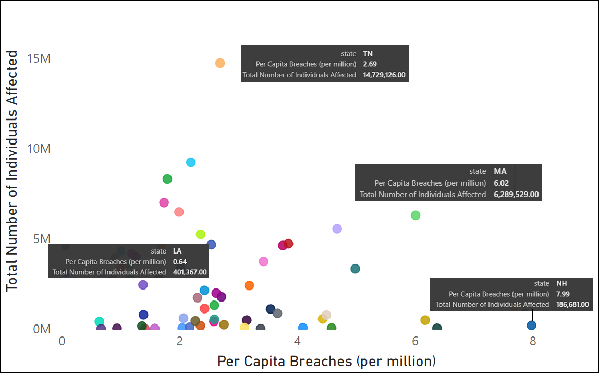

<a id="healthcare-data-breaches-analysis"></a>
# Analysis of Healthcare Data Breaches 
### Case Study Using US Dept. of Health and Human Services (USHHS) Open Source Data from July 19, 2021 to August 10, 2023  
##### - [Statement of Business Task](#statement-of-business-task)
##### - [Description of Data Source](#description-of-data-source)
##### - [Data ETL Analyses and Results](#data-etl-analyses-and-results)
##### - [Conclusions and Insights](#conclusions-and-insights)
##### - [References](#references)
---
### Statement of Business Task
Cybersecurity is important across domains, but the U.S. healthcare industry is particularly vulnerable, with many cybercriminal attacks in the last decade trying to take advantage of medical facilities' high stakes data for extortion.[^1] The current business task is to conduct an exploratory analysis, to find patterns and potential avenues for further inquiry, into one element of cybersecurity risk that criminals may take advantage of: breaches of unsecured protected health information.  

### Description of Data Source
This open public data source is provided by the U.S. Department of Health and Human Services (HHS) in accordance with section 13402(e)(4) of the HITECH Act (https://ocrportal.hhs.gov/ocr/breach/breach_report.jsf).
The data range selected included cases currently under investigation, from July 19, 2021 to August 10, 2023.  

### Data ETL Analyses and Results
The ["breach.csv"](data/breach_report.csv) data download from the U.S. HHS site was imported into Python with the pandas and numpy libraries. Rows with null values were dropped, and further transformations for particular analyses/visualizations included filtering data for "Hacking/IT Incidents", splitting the data into train/test sets (for predictive models), aggregating counts by month and year, and text-to-column creation of new columns from the contents of a single column with multiple possible categories ("location_of_breached_information"). Because one column ('web_description') was mostly null, it was also excluded from the dataframe. The complete cleaned up dataframe resulted in 900 rows. The full code for these transformations and analyses can be found in the Jupyter Notebook file on this site's data folder ["US_HSS_SecurityBreachAnalysis"](data/US_HSS_SecurityBreachAnalysis.ipynb).  

#### Initial Overview and Summary of Results  
  * Preview (head function) of first lines of data within this dataframe indicates the fields and the type of content that might be of interest:  

<table border="1" class="dataframe">
  <thead>
    <tr style="text-align: right;">
      <th>name_of_covered_entity</th>
      <th>state</th>
      <th>covered_entity_type</th>
      <th>individuals_affected</th>
      <th>breach_submission_date</th>
      <th>type_of_breach</th>
      <th>location_of_breached_information</th>
      <th>business_associate_present</th>
      <th>Email</th>
      <th>Network Server</th>
      <th>Other</th>
      <th>Paper/Films</th>
      <th>Desktop Computer</th>
      <th>Electronic Medical Record</th>
      <th>Laptop</th>
      <th>Other Portable Electronic Device</th>
    </tr>
  </thead>
  <tbody>
    <tr>
      <td>iTrust Wellness Group</td>
      <td>SC</td>
      <td>Healthcare Provider</td>
      <td>981</td>
      <td>8/10/2023</td>
      <td>Hacking/IT Incident</td>
      <td>Email</td>
      <td>No</td>
      <td>1</td>
      <td>0</td>
      <td>0</td>
      <td>0</td>
      <td>0</td>
      <td>0</td>
      <td>0</td>
      <td>0</td>
    </tr>
    <tr>
      <td>Madera County</td>
      <td>CA</td>
      <td>Health Plan</td>
      <td>1146</td>
      <td>8/9/2023</td>
      <td>Unauthorized Access/Disclosure</td>
      <td>Email</td>
      <td>No</td>
      <td>1</td>
      <td>0</td>
      <td>0</td>
      <td>0</td>
      <td>0</td>
      <td>0</td>
      <td>0</td>
      <td>0</td>
    </tr>
    <tr>
      <td>PCC Pediatric EHR Solutions</td>
      <td>VT</td>
      <td>Business Associate</td>
      <td>520</td>
      <td>8/9/2023</td>
      <td>Unauthorized Access/Disclosure</td>
      <td>Email</td>
      <td>Yes</td>
      <td>1</td>
      <td>0</td>
      <td>0</td>
      <td>0</td>
      <td>0</td>
      <td>0</td>
      <td>0</td>
      <td>0</td>
    </tr>
    <tr>
      <td>Premera Blue Cross</td>
      <td>WA</td>
      <td>Health Plan</td>
      <td>33212</td>
      <td>8/8/2023</td>
      <td>Hacking/IT Incident</td>
      <td>Network Server</td>
      <td>Yes</td>
      <td>0</td>
      <td>1</td>
      <td>0</td>
      <td>0</td>
      <td>0</td>
      <td>0</td>
      <td>0</td>
      <td>0</td>
    </tr>
    <tr>
      <td>Redwood Coast Regional Center</td>
      <td>CA</td>
      <td>Healthcare Provider</td>
      <td>1345</td>
      <td>8/7/2023</td>
      <td>Hacking/IT Incident</td>
      <td>Email</td>
      <td>No</td>
      <td>1</td>
      <td>0</td>
      <td>0</td>
      <td>0</td>
      <td>0</td>
      <td>0</td>
      <td>0</td>
      <td>0</td>
    </tr>
  </tbody>
</table>

**Geographical Factors**    

  * A summary of the top ten states by count and % of breaches for the entire time period (note that bottom two were tied):
    
   
 
While, unsurprisingly the top five states happen to also be the top five in population, what is interesting to note is that the rankings in breaches are not a one-to-one match with population ranks (compare the above table to this ranked list: https://www.statsamerica.org/sip/rank_list.aspx?rank_label=pop1). New York and Massachucetts for example are over-represented in breaches based on their ranks for population; meanwhile, California, Florida, Georgia, and Michigan are under-represented in the number of breaches when their population rank is taken into consideration.  
Perhaps a per capita metric (Number of Breaches per Million People) could be more telling. The following code was used to calculate the metric:  
```python
# Obtain the population data for each state (from StatsAmerica.org)
population = {
    'CA': 39029342,'TX': 30029572,'FL': 22244823,'NY': 19677151,'PA': 12972008,'IL': 12812032,'OH': 11756058,
    'GA': 10912876,'NC': 10698973,'MI': 10034113,'NJ': 9288994,'VA': 8683619,'WA': 7785786,'AZ': 7359197,
    'TN': 7051339,'MA': 6981974,'IN': 6833037,'MO': 6177957,'MD': 6177224,'WI': 5893718,'CO': 5773714,
    'MN': 5706494,'SC': 5118425,'AL': 5024279,'LA': 4657757,'KY': 4505836,'OR': 4237256,'OK': 3959353,
    'CT': 3605944,'UT': 3271616,'IA': 3179849,'NV': 3179849,'AK': 731545,'MS': 2965997,'KS': 2913314,
    'NM': 2117522,'NE': 1961504,'ID': 1893147,'WV': 1778070,'HI': 1461933,'NH': 1377529,'ME': 1377529,
    'MT': 1086767,'RI': 1097379,'DE': 1001687,'SD': 886667,'ND': 770026,'DC': 705749,'VT': 643503
}

# Calculate the "Breaches per Million People" metric
state_summary['Breaches per Million People'] = (state_summary['Count'] / state_summary.index.map(population)) * 1_000_000

# Sort the DataFrame by the calculated metric
state_summary = state_summary.sort_values(by='Breaches per Million People', ascending=False)

# Display the top 10 states by the metric
top_10_states = state_summary.head(10)
print("Top 10 States by Breaches per Million People:")
print(top_10_states)
```
Which results in the following new distribution of Top 10 States by Breaches per Million:  
```
Top 10 States by Breaches per Million People:
    Count  % of Total  Breaches per Million People
NH     11    1.222222                     7.985313
RI      7    0.777778                     6.378835
KS     18    2.000000                     6.178531
MA     42    4.666667                     6.015491
DE      5    0.555556                     4.991579
IN     32    3.555556                     4.683130
NE      9    1.000000                     4.588316
WV      8    0.888889                     4.499260
CT     16    1.777778                     4.437118
AK      3    0.333333                     4.100910
```
As another way of visualizing this per-capita metric geographically, Power BI was used directly on the breaches.csv data source, with the Breaches per Million People metric calculated within PowerQuery. Within PowerQuery, the same transformations that were applied in Python (e.g., removing rows with nulls) were performed in PowerBI so it was an equivalent dataset. The PowerBI file can be downloaded here for inspection.

* Geographic heat map of lower 48 states by Breaches per Million People (based on state population)  
  - At 7.99, **NH** had the highest Breaches per million people and was 1,140% higher than **LA**, which had the lowest Breaches per million people at 0.64.
   

As can be seen in the heat map, the greatest concentration of breaches per million people happened in the Northeast and Midwest (NE and KS), while least was in the mid-South region (LA & AR) and West.

* Relationship between Per Capita Breaches (per million) and Total Number of Individuals Affected
  - Individual states were plotted by the per capita number of breaches and the total number of individuals affected:
    
 

Although no relationship between these variables was found (*r*(49) = -0.02, *p*=0.05), upon investigating the extremes on either side of an imaginary diagonal (that splits the lower left from upper right)  those states with relatively poor performance (i.e., states with higher per capita breaches AND more individuals affected) versus states with better performance (i.e., lower per capita breaches AND fewer individuals involved) are displayed.  
States such as LA, MS, and NV had relatively fewer breaches for their population AND fewer individuals affected when those breaches did occur. States such as TN, MA, and NH were poor performers (with either having many people affected and a moderate per capita breach number, like TN, or many per-capita breaches though fewer individuals affected, like NH; MA was a worst balance between many per capita breaches AND many individuals affected).  

**Data Source Factors**  
*Where are these data breaches coming from? How are they categorized?*
Knowing the kinds of breaches that were recorded--where the most occurred--may help guide further analyses; data can be filtered further down to the most likely scenarios.  
* The field "covered_entity_type" provides information for what kind of provider the breach came from. Viewing the distribution of records, the majority are from Healthcare Providers:
```  
Summary table for 'covered_entity_type' column:
                           Count  % of Total
Healthcare Provider          569   63.222222
Business Associate           204   22.666667
Health Plan                  126   14.000000
Healthcare Clearing House      1    0.111111
```  

* The field "type_of_breach" provides the kind of cybersecurity incident these were categorized into. Hacking/IT Incidents were the large majority of breaches listed:
```  
  Summary table for 'type_of_breach' column:
                                Count  % of Total
Hacking/IT Incident               728   80.888889
Unauthorized Access/Disclosure    144   16.000000
Theft                              17    1.888889
Loss                                6    0.666667
Improper Disposal                   5    0.555556
```
* The "location_of_breached_information" denotes where the breach of information occurred. Because this field could have multiple categories listed in one incident, a new updated dataframe was prepared that had these different categories split out into their own respective columns. A "Yes" or "No" entry was recorded for the category if was present on that cybersecurity incident. The vast majority of individuals affected occurred on Network Server breach locations:


Because Hacking/IT Incidents are the most frequent type of cybersecurity breach in this dataset, the dataframe was filtered to these types of events. For Hacking/IT Incidents alone, Network Servers, Email, and Electronic Health Records were the most frequent place where the incident occurred:


**Time Series/Seasonality Factors**  


<sub>[Back to top](#healthcare-data-breaches-analysis)</sub>

---
### References 
[^1]: Brodkin, J. (2023, August 4). Our health care system may soon receive a much-needed cybersecurity boost. Ars Technica. Retrieved from https://arstechnica.com/information-technology/2023/08/our-health-care-system-may-soon-receive-a-much-needed-cybersecurity-boost/
